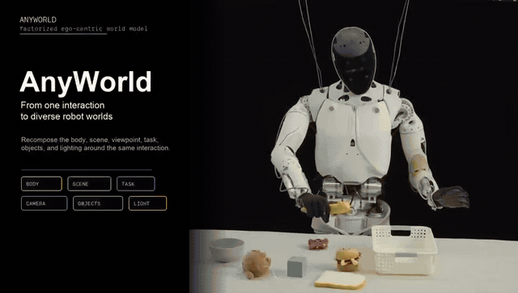

# AnyWorld 代码发布

[**论文**](https://arxiv.org/abs/2608.29242) · [**项目主页**](https://xpeng-robotics.github.io/anyworld/) · [**English**](README.md)

  

<b>▶ 点击预览查看完整 AnyWorld 宣传视频</b>

## Highlights

- **因子化跨本体重组**：分别控制 action、camera、embodiment 与 scene context，将人类交互重组为 robot-native rollout。
- **无配对人机 grounding**：从人类第一视角交互中学习可迁移结构，无需成对人机视频即可适配目标机器人本体。
- **Targeted intervention generation（定向干预生成）**：同一个因子化生成器既支持跨 action、viewpoint、embodiment 与 scene 的 **大规模 robot-native experience scaling**，也支持 **面向 policy gaps 的 targeted intervention**，通过构造缺失的 robot-native 状态与 matched counterfactual instruction–action pairs 实现按需干预。

## 代码

- `image_editing/`：reverse pseudo-pair 构造与 embodiment editor 训练/推理。
- `world_model/`：factorized action-camera-embodiment world-model inference。
- `scripts/`：image editor 训练与 world model 推理启动脚本。
- `docs/`：输入格式、几何约定与外部模型权重组织方式。

World model 推理时，Wan2.1 Combined-Control 提供基础 pipeline 组件，AnyWorld 单独加载适配后的 world-model Transformer 权重。具体安装与运行命令见英文 [README](README.md)。

## License

代码使用 [Apache License 2.0](LICENSE)。
